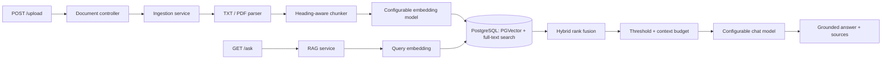

# RAG Pipeline Service

A Spring Boot REST service that accepts raw plain text or text-based PDF documents, creates
structure-aware chunks, stores embeddings in PostgreSQL with PGVector, and answers
questions using only retrieved document evidence.

## Architecture



The HTTP/application, parsing, chunking, AI-provider, and persistence boundaries
are deliberately separate. A future LangChain or LangGraph chatbot should call
this service over HTTP; it does not need to be embedded in the Java process.

## Technology

- Java 21 and Spring Boot 4.1
- Spring AI 2.0 provider abstractions
- OpenAI embeddings by default: `text-embedding-3-small` (1,536 dimensions)
- OpenAI answer generation by default: `gpt-5.6-luna`
- PostgreSQL 17 with PGVector cosine search, an HNSW vector index, and a GIN
  full-text index
- Flyway migrations, PDFBox 3, JUnit, Mockito, and Testcontainers

## Quick start

The only prerequisite is Docker Desktop (or Docker Engine with Compose). Java,
Maven, PostgreSQL, and PGVector are provided by containers.

```bash
git clone <repository-url>
cd <repository-directory>
cp .env.example .env
```

Edit `.env` and replace `OPENAI_API_KEY=replace-me` with a valid key. Gemini is
optional unless a `google-genai` provider is selected.

Start and health-check the complete stack with one command:

macOS/Linux:

```bash
sh ./start.sh
```

Windows PowerShell:

```powershell
powershell -ExecutionPolicy Bypass -File .\start.ps1
```

The launchers validate Docker and the active provider keys, build the application,
start every container, wait for readiness, and print the local URLs. The direct
Compose equivalent is:

```bash
docker compose up --build --detach --wait --wait-timeout 180
```

The stack contains:

| Service | URL/port |
|---|---|
| RAG API | `http://localhost:8080` |
| Health | `http://localhost:8080/actuator/health` |
| Adminer | `http://localhost:8081` |
| PostgreSQL/PGVector | `localhost:5432` |

Adminer provides a local browser-based PostgreSQL viewer at
`http://localhost:8081`. Log in with system `PostgreSQL`, server `postgres`,
database `rag`, and the configured PostgreSQL username/password. The port is
bound to `127.0.0.1` so it is not exposed to other machines.

Upload the included sample as a raw plain-text body:

```bash
curl -X POST http://localhost:8080/upload \
  -H "Content-Type: text/plain" \
  --data-binary "@samples/employee-handbook.txt"
```

Example response:

```json
{
  "documentId": "91a2c870-285f-4bd3-9f73-dc93981d769f",
  "fileName": "plain-text-input",
  "contentType": "text/plain",
  "chunksCreated": 2,
  "status": "INDEXED"
}
```

Ask across all documents:

```bash
curl --get http://localhost:8080/ask \
  --data-urlencode "q=How many annual leave days do full-time employees receive?"
```

Restrict retrieval to one upload:

```bash
curl --get http://localhost:8080/ask \
  --data-urlencode "q=How many annual leave days do full-time employees receive?" \
  --data-urlencode "documentId=91a2c870-285f-4bd3-9f73-dc93981d769f"
```

Supported answers include `[Source N]` citations and structured source metadata.
If no chunk clears the relevance threshold, the endpoint returns HTTP 200 with
`found: false`, an empty source list, and no LLM call.

## API contract

### `POST /upload`

Accepts either a raw `text/plain` request body or `multipart/form-data` with a
required PDF `file` part. `.txt` file uploads are not accepted. Both inputs are
limited to 10 MiB by default.

- `201 Created`: a new document was indexed.
- `200 OK`: the same bytes were already indexed with the active embedding model.
- `400 Bad Request`: missing/empty file or invalid input.
- `413 Payload Too Large`: configured upload limit exceeded.
- `415 Unsupported Media Type`: unsupported extension.
- `422 Unprocessable Entity`: invalid UTF-8/PDF or no extractable text.
- `503 Service Unavailable`: database or AI dependency unavailable.

### `GET /ask?q=...&documentId=...`

`documentId` is optional. The response contains `question`, `answer`, `found`,
and `sources`. Blank, excessively long, and questions with fewer than three
letters or digits return HTTP 400. All error responses use RFC 9457 Problem
Details and include a trace ID.

## Provider configuration

Embedding and answer-generation providers are independent:

| Purpose | Environment variables | Default |
|---|---|---|
| Embeddings | `RAG_EMBEDDING_PROVIDER`, `RAG_EMBEDDING_MODEL` | `openai`, `text-embedding-3-small` |
| Answers | `RAG_CHAT_PROVIDER`, `RAG_CHAT_MODEL` | `openai`, `gpt-5.6-luna` |

Both providers use the Spring AI identifiers `google-genai` or `openai`.

The default configuration is:

```dotenv
RAG_EMBEDDING_PROVIDER=openai
RAG_EMBEDDING_MODEL=text-embedding-3-small
RAG_EMBEDDING_DIMENSIONS=1536
RAG_CHAT_PROVIDER=openai
RAG_CHAT_MODEL=gpt-5.6-luna
```

To use Gemini, set the relevant provider to `google-genai`, choose a compatible
Gemini model, and supply `GEMINI_API_KEY`.

For Gemini embeddings and answers:

```dotenv
GEMINI_API_KEY=your-key
RAG_EMBEDDING_PROVIDER=google-genai
RAG_EMBEDDING_MODEL=gemini-embedding-001
RAG_CHAT_PROVIDER=google-genai
RAG_CHAT_MODEL=gemini-3.5-flash
```

Provider and model selection is intentionally deployment configuration, not a
public request parameter. This keeps indexing reproducible, prevents callers from
selecting unapproved or unexpectedly expensive models, and avoids mixing embedding
spaces. If per-request routing is needed later, add an authenticated, allowlisted
model profile (for example `fast` or `quality`) rather than accepting raw provider
and model names.

The vector schema is intentionally fixed at 1,536 dimensions so either embedding
provider can use the same physical schema. Vectors from different providers or
models are never compared: provider, model, and dimension form an embedding
fingerprint. After changing an embedding model, upload documents again. The same
file may coexist under a different embedding fingerprint.

## Chunking rationale

The chunker:

1. Preserves PDF pages, paragraphs, and Markdown-like headings.
2. Starts a new chunk when a heading changes, without cross-topic overlap.
3. Accumulates content within a section up to an estimated 800-token ceiling.
4. Splits oversized paragraphs at sentence boundaries, then word boundaries.
5. Adds up to 100 estimated tokens of overlap within long sections.
6. Stores document, page range, heading, index, and source hash metadata.

The estimate uses approximately four characters per token so it is deterministic
and provider-neutral. The limits are configurable and should be tuned with the
evaluation set rather than treated as universal values.

Chunk sizing is configured with `RAG_CHUNK_MIN_TOKENS` (default `40`),
`RAG_CHUNK_MAX_TOKENS` (default `800`), and `RAG_CHUNK_OVERLAP_TOKENS`
(default `100`). The maximum and overlap are enforced by the current chunker.
The minimum is reserved for small-chunk merging and is not yet enforced.

Additional operational limits are configurable:

| Setting | Default | Purpose |
|---|---:|---|
| `RAG_MAX_UPLOAD_BYTES` | `10485760` | Maximum uploaded file size |
| `RAG_MAX_DOCUMENT_TOKENS` | `100000` | Maximum estimated tokens after text extraction |
| `RAG_EMBEDDING_BATCH_SIZE` | `100` | Chunks sent in each embedding request |
| `RAG_CONTEXT_MAX_TOKENS` | `4000` | Retrieved context supplied to the answer model |
| `RAG_MAX_ANSWER_TOKENS` | `1000` | Maximum generated answer tokens |

Configuration is validated at startup, including upper bounds and relationships
such as overlap and minimum chunk sizes being smaller than the maximum chunk size.

## Grounding and retrieval

- The same configured embedding model and dimension are used for chunks and queries.
- Gemini receives distinct `RETRIEVAL_DOCUMENT` and `RETRIEVAL_QUERY` task types.
- Embeddings are normalized before storage/search.
- Retrieval takes up to 20 vector candidates and 20 PostgreSQL English full-text
  candidates, then merges and reranks their union.
- A candidate is eligible when either its cosine similarity or lexical query-term
  coverage clears the configurable relevance threshold. This prevents the absence
  of an exact keyword from suppressing a valid semantic match.
- Eligible candidates are combined using weighted Reciprocal Rank Fusion: 70%
  vector rank and 30% full-text rank. Headings receive higher PostgreSQL
  full-text weight when selecting lexical candidates.
- The final result uses top-K 5 and a default per-channel relevance threshold of
  0.50.
- Duplicate chunks are removed and ranked chunks are added until the 4,000-token
  context budget is reached.
- Retrieved text is explicitly treated as untrusted data, and the prompt prohibits
  outside knowledge and unsupported citations.
- No relevant evidence means a deterministic refusal without an answer-model call.

The retrieval controls are `RAG_RETRIEVAL_TOP_K`,
`RAG_RETRIEVAL_CANDIDATE_K`, `RAG_RETRIEVAL_MINIMUM_SCORE`,
`RAG_RETRIEVAL_VECTOR_WEIGHT`, and `RAG_RETRIEVAL_TEXT_WEIGHT`. The two weights
must add up to `1.0`, and the candidate count must be at least the final top-K.

## Local development and tests

Install JDK 21, then start only PostgreSQL if desired:

```bash
docker compose up -d postgres
./mvnw spring-boot:run
```

Windows:

```powershell
docker compose up -d postgres
.\mvnw.cmd spring-boot:run
```

Run the test suite:

```bash
./mvnw verify
```

The integration suite uses `pgvector/pgvector:pg17` through Testcontainers. It
verifies full Spring startup with both AI providers, automatic Flyway migration,
vector insertion, Flyway full-text migration, and hybrid retrieval;
Docker-dependent tests are skipped when Docker is unavailable. Unit tests cover chunk boundaries and overlap, page
extraction, context budgeting/deduplication, and the no-evidence path.

GitHub Actions runs the same Maven verification suite on every push and pull
request; API secrets are not required because provider calls are mocked in tests.

The small retrieval evaluation corpus is in `evaluation/questions.json`. Recommended
baseline metrics are Hit@5, citation correctness, refusal accuracy, repeat stability,
and p50/p95 latency.

## Operations

Stop the stack while preserving indexed data:

```bash
docker compose down
```

Delete all local containers and indexed data:

```bash
docker compose down --volumes
```

The second command is destructive. Flyway recreates the schema on the next start.

## Production follow-ups

The exercise intentionally omits authentication, tenant isolation, OCR, raw-file
object storage, asynchronous ingestion, delete/re-index APIs, streaming responses,
and a learned reranker. Add those only after measuring the baseline. For a
chatbot UI, keep conversation state and LangGraph orchestration in a separate service
and use this service as the stateless evidence-retrieval and answering boundary.
